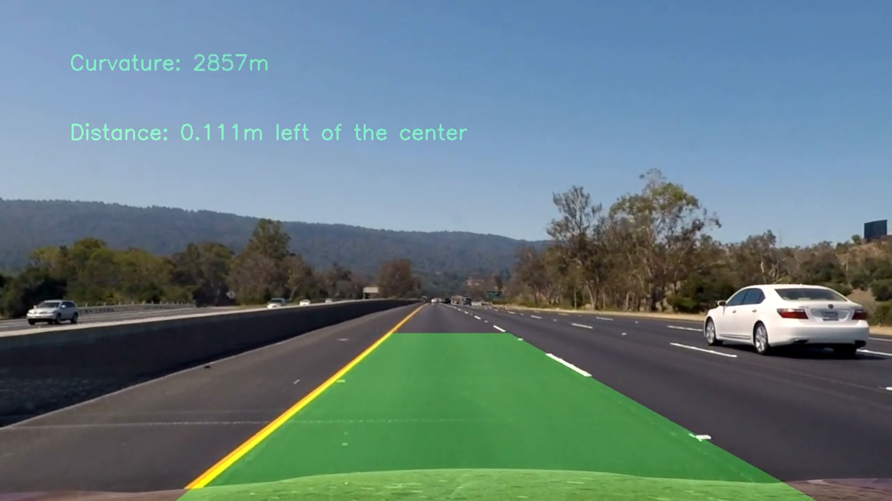
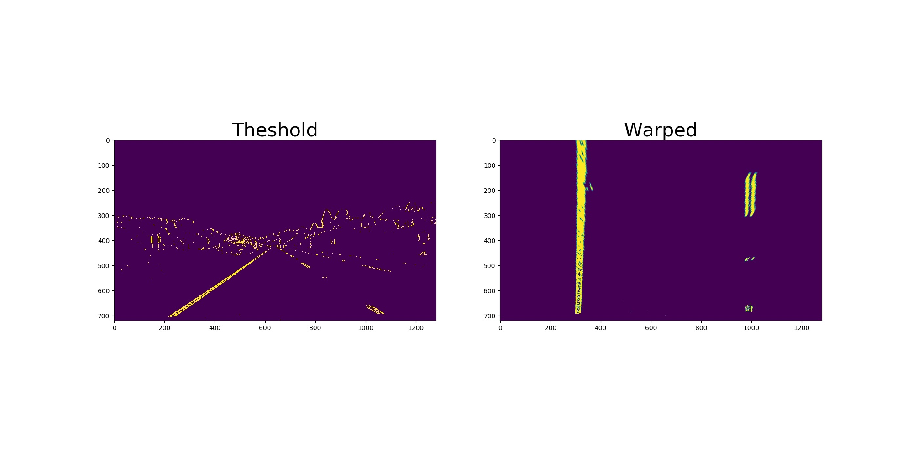
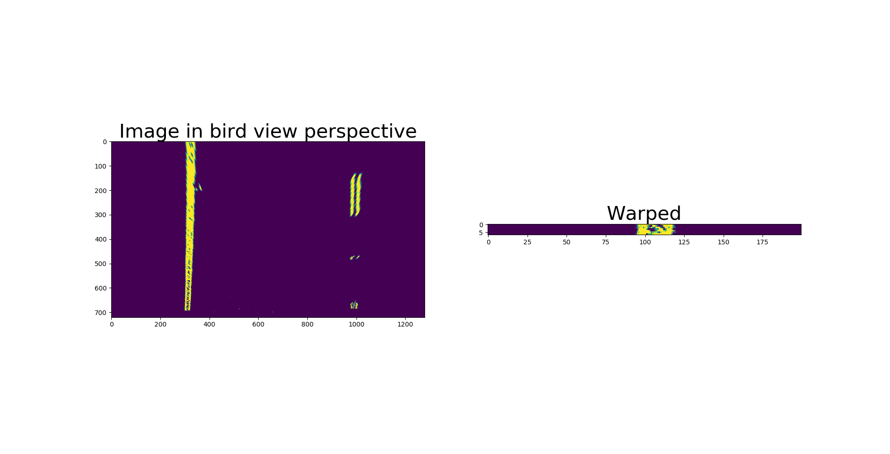

## Advanced Lane Finding
[](http://www.udacity.com/drive)


[//]: # (Image References)


In this project, the goal is to write a software pipelie to identify the lane boundaries in a video.

The Project
---

This project takes a picture, finds the lane boundaries and displays them, as well as information about the route and the position of the car relative to the lanes

Here are the steps of the pipeline: 
* Get the calibration coefficients for the camera using a set of chessboard images
* For each image we want to process: 
  * Apply a distortion correction to raw images
  * Use color transform and gradients to create a new binary image that highlights the points of interest
  * Apply a perspective transform to get the image in "birds-eye view"
  * Detect the line pixels to get the lane boundary
  * Calculate the curvature and use it for a sanity check 
  * Draw the lines into a new image 
  * Put the line image into the original image perspective
  * Warp the lane boundary on the original picture
  
All the code for this pipeline is in `find_lanes.py`

You can find the output of the pipeline for `project_video.mp4`, called `project_video_output.mp4` in the `output_video folder` or at the bottom of this page.
The challenge videos are not working. 

Camera Calibration and distortion
--
The images used to get the calibration coefficients are in the `camera_cal` folder. 

The `calibrate()` method converts the image into gray scale, gets all the corners of the chessboards and puts the coordinates into lists using `cv2.findChessboardCorners`. Those lists are passed to `cv2.calibrateCamera` to  get the coefficients to undistort the camera.

The coefficients are then used to undistort the image we are processing.

Before and after distorting a chessboard image: 


Color and gradient thresholds
--
The color and gradient threshold step helps us filter part of the image out (see `apply_thresholds(image)`). 
Before applying the gradients thresholds, I converted the image to gray.
I applied the threshold to:  
* The sobelx grandient
* The magnitude gradient

I then converted the image to hls, and applied a threshold on the saturation channel. 


To achieve the result I took the pixels that are both in the magnitude binary image, and sobelx binary image. And added to them the saturation binary pixels that fit my threshold. 
The result is as follow: 


Perspective Change
--
To be able to fit polynomials on the lanes we need to change the perspective to be from the top (see `perspective_transform()`):
. 
To change the perspective, I took 4 points in the original image and defines 4 points where they should be.  in the "bird view"
These 2 sets of 4 points are then passed to `cv2.getPerspectiveTransform` to get the perspective transform matrix M. 

We then warp the image with M  using `cv2.warpPerspective`. 



## Detect the lane 
There are 2 ways to detect the lane, using sliding windows, and using the polynomial from the previous picture (see `detect_lines()`)

#### Sliding wondow approach
The sliding window approach consists dividing the picture in small subsets of the picture, and looks for the highlighted windows (see `detect_lines_windows()`.  
Using those windows we get a set of coordinates we can use to extrapolate a polynomial. 

`x` is the average x of the highlighted pixels
`y` is the bottom of the window

 
We use `np.polyfit(left_peaks_y, left_peaks_x, 2)` to get the coefficients of the polynomial that fits the best.



#### Polynomial approach

We look for the pixels highlighted that are around another polynomial, we previously calculated. Using the coordinates of those new pixels, we can get the coefficients that would fit our new coefficients the best.

#### Choice between sliding window and polynomial 
The most efficient way of doing the search is using the the polynomial of the last picture. 
That being said, there are cases where we can't use this approach: 
* If the picture is standalone
* If we couldn't find enough pixels in the area to build a new polynomial

#### Sanity check
Once we have the polynomials that best fit the picture, we can measure the curvature of the road. Using the curvature we can determine if the latest polinomial makes sense. 
If it doesn't we will take the picture and search using the sliding window method.
After measuring the curvature again, if it still doesn't look right, we use the same polynomial as the last picture


Measuring Curvature and distance
---
See `measure_curvature()` and `measure_distance_from_center()` 

To measure the curvature of the road, we use the average of the left and right lane curvature. 
Before measuring the curvature of one lane, we needs to get the polynomial in meters. We use the coordinates of the pixels highlighted pixels and convert them to meters before getting the new polynomial.
Then we use the following equation to get the curvature: 
`curv = ((1 + (2 * poly[0] * y_eval * ym_per_pix + poly[1]) ** 2) ** 1.5) / np.absolute(2 * poly[0])1`

In the warped pictures, 
On the y axis, I have 700 relevant pixels, that represent roughly 15m
On the x axis, I have 1000 relevant pixels, that represent roughly 3.7 m
That is why I used the following values to scale the curvature calculations.
```    
ym_per_pix = 15. / 720
xm_per_pix = 3.7 / 1000 
```

To calculate the distance to the center, we get the x where the each lane touches bottom of the image.
Get the middle position between them, and compare to the center of the image (which is the center of the car). 
Then we convert to meters and display 

Shortcomings
---
* This projects could not be used in real time, as it takes longer to process than to play the video, we could use separate the pipeline into different processes to speed it up, or maybe process less images. 
* This project is writen to process flat, or almost flat roads, the perspective coefficients would need to be different if we wanted to process an uphill or downhill video.
* The `apply_thresholds` needs to be improved to handle change in lighting or roads that are different color like in the challenge videos.

Result 
---
Here is a gif of the output video:
You can also download the output video for `project_video.mp4` in `output_video/project_video_output.mp4`


