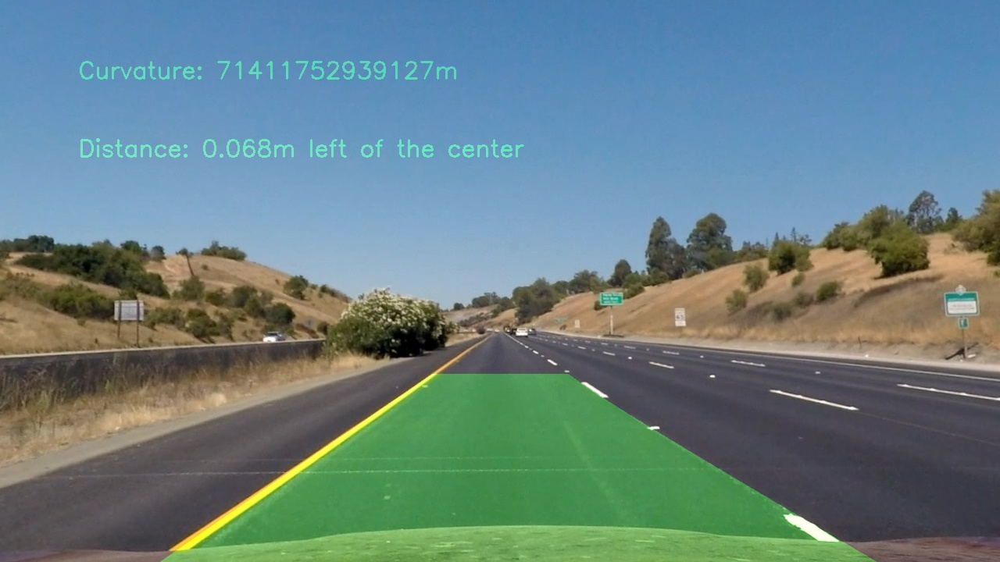
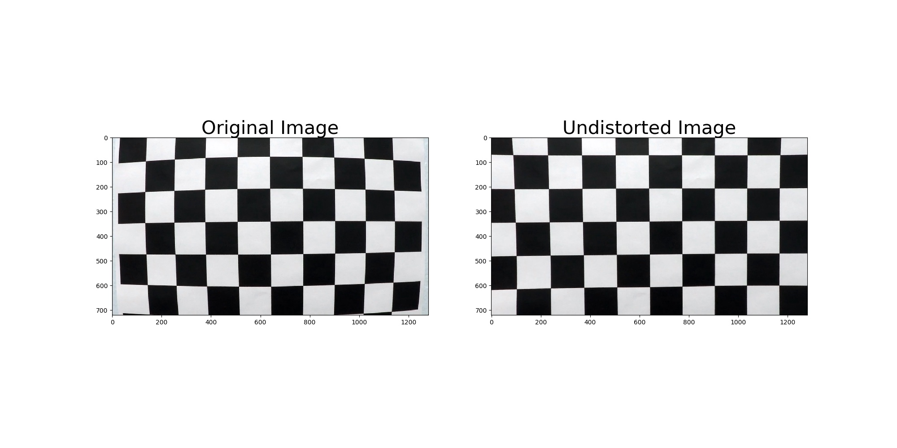
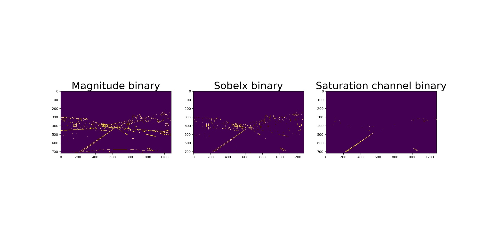
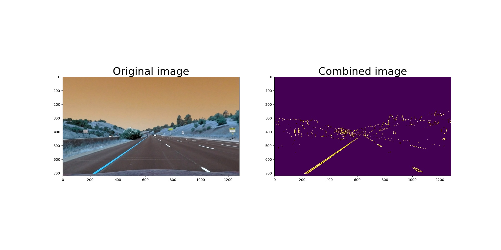

## Advanced Lane Finding

[//]: # (Image References)

In this project, the goal is to write a software pipeline to identify the lane boundaries in a video.

The Project
---

In order to go from *Fig 1* to *Fig2* we need to follow the following steps: 

* Get the calibration coefficients for the camera beeing used using a set of chessboard images
* For each image we want to process: 
  * Apply a distortion correction to raw images
  * Use color transform and gradients to create a new binary image that highlights the points of interest
  * Apply a perspective transform to get the image in "birds-eye view"
  * Detect the line pixels to get the lane boundary
  * Warp the lane boundary on the original picture
  
All the code for this pipeline is in `find_lanes.py`
 
TODO Add a note on the curvature and all 
TODO explain each  steps

Camera Calibration and distortion
--
The images used to get the calibration coefficients are in the `camera_cal` folder. 

The `calibrate()` method converts the image into gray scale, gets all the corners of the chessboards and puts the coordinates into lists using `cv2.findChessboardCorners`. Those lists are passed to `cv2.calibrateCamera` to  get the coefficients to undistort the camera.

The coefficients are then used to undistort the image we are processing.

Before and after distorting a chessboard image: 

Color and gradient thresholds
--
The color and gradient threshold step helps us filter part of the image out (see `apply_thresholds(image)`). 
Before applying the gradients thresholds, I converted the image to gray.
I applied the threshold to:  
* The sobelx grandient
* The magnitude gradient

I then converted the image to hls, and applied a threshold on the saturation channel. 

To achieve the result I took the pixels that are both in the magnitude binary image, and sobelx binary image. And added to them the saturation binary pixels that fit my threshold. 
The result is as follow: 

Perspective Change
--
To be able to fit polynomials on the lanes we need to change the perspective to be from the top (see `perspective_transform()`):
. 
To change the perspective, I took 4 points in the original image and defines 4 points where they should be. 
These 2 sets of 4 points are then passed to `cv2.getPerspectiveTransform` to get the perspective transform matrix M. 

We then warp the image with M  using `cv2.warpPerspective`. 

TODO ADD IMAGE 

Detect the lane 
---
TODO
There are 2 ways to detect the lane. 
If the image we are processing is a standalone image, or the first image of the video, we search for the lanes using a sliding window search. 

What was already there 
---
The goals / steps of this project are the following:

* Compute the camera calibration matrix and distortion coefficients given a set of chessboard images.
* Apply a distortion correction to raw images.
* Use color transforms, gradients, etc., to create a thresholded binary image.
* Apply a perspective transform to rectify binary image ("birds-eye view").
* Detect lane pixels and fit to find the lane boundary.
* Determine the curvature of the lane and vehicle position with respect to center.
* Warp the detected lane boundaries back onto the original image.
* Output visual display of the lane boundaries and numerical estimation of lane curvature and vehicle position.

The images for camera calibration are stored in the folder called `camera_cal`.  The images in `test_images` are for testing your pipeline on single frames.  If you want to extract more test images from the videos, you can simply use an image writing method like `cv2.imwrite()`, i.e., you can read the video in frame by frame as usual, and for frames you want to save for later you can write to an image file.  

To help the reviewer examine your work, please save examples of the output from each stage of your pipeline in the folder called `output_images`, and include a description in your writeup for the project of what each image shows.    The video called `project_video.mp4` is the video your pipeline should work well on.  

The `challenge_video.mp4` video is an extra (and optional) challenge for you if you want to test your pipeline under somewhat trickier conditions.  The `harder_challenge.mp4` video is another optional challenge and is brutal!

If you're feeling ambitious (again, totally optional though), don't stop there!  We encourage you to go out and take video of your own, calibrate your camera and show us how you would implement this project from scratch!

## How to write a README
A well written README file can enhance your project and portfolio.  Develop your abilities to create professional README files by completing [this free course](https://www.udacity.com/course/writing-readmes--ud777).

